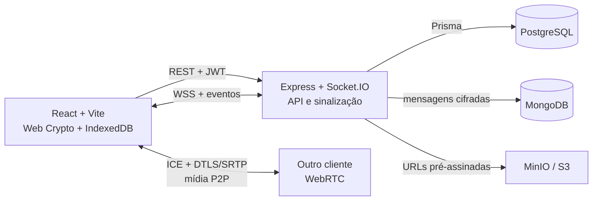
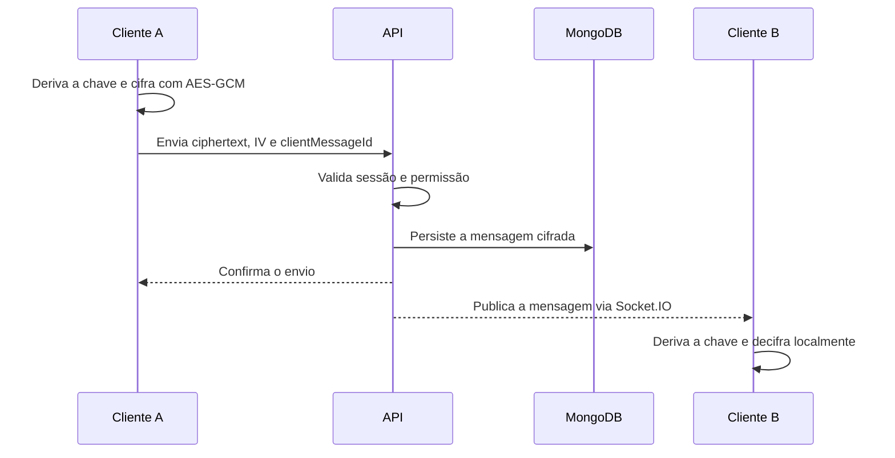
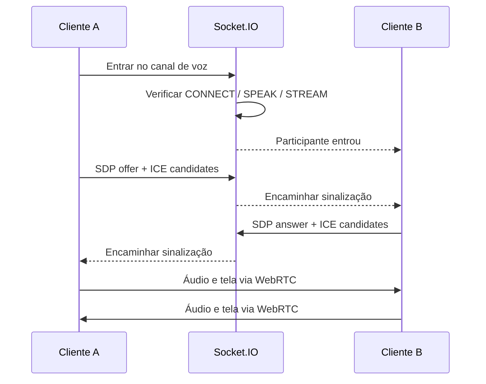
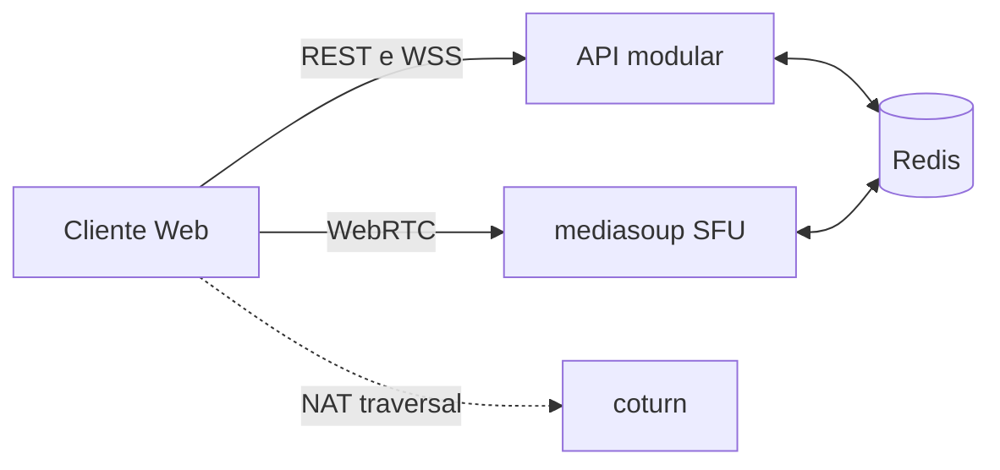

<div align="center">

# Lucaco

### Comunicação em tempo real, criptografia ponta a ponta e streaming com WebRTC


Uma plataforma open source de comunidades, chat, voz e compartilhamento de tela inspirada no Discord.

</div>

## Sobre o projeto

O Lucaco foi desenvolvido para fins acadêmicos e de aprendizado. O projeto serve como laboratório prático para estudar **WebRTC**, transporte de mídia sobre **UDP**, sinalização em tempo real, criptografia ponta a ponta, controle de acesso e armazenamento distribuído.

A captura de tela usa `getDisplayMedia()`, a interface do navegador para as APIs nativas do sistema operacional, como ScreenCaptureKit, Windows Graphics Capture e PipeWire. Um dos objetivos experimentais é entender e contornar limitações de captura associadas a DRM sem remover ou descriptografar a proteção do conteúdo.

> Use o projeto apenas com conteúdo, contas e ambientes para os quais você tenha autorização.

## Screenshots

Substitua os espaços abaixo por imagens salvas em `docs/screenshots/`.

| Comunidades e canais | Conversas e mídia |
| --- | --- |
| _Adicione `docs/screenshots/servidores.png`_ | _Adicione `docs/screenshots/chat.png`_ |

| Chamada e compartilhamento de tela | Configurações |
| --- | --- |
| _Adicione `docs/screenshots/chamada.png`_ | _Adicione `docs/screenshots/configuracoes.png`_ |

Depois, troque cada texto pelo Markdown correspondente:

```md

```

## Funcionalidades

- Cadastro, login, sessão com access token e refresh token rotativo.
- Amizades, solicitações, bloqueios e conversas diretas.
- Comunidades públicas e privadas, convites, membros e moderação.
- Canais de texto, papéis e permissões por bitfield.
- Mensagens em tempo real, indicador de digitação e notificações.
- Mensagens de texto criptografadas no cliente com Web Crypto API.
- Upload de imagens, arquivos e mensagens de áudio em storage compatível com S3.
- Canal de voz e compartilhamento de aba com áudio via WebRTC.
- Tema, perfil, preferências de áudio e notificações.
- Seed local com uma conta e comunidades prontas para desenvolvimento.

## Arquitetura

O sistema separa o **plano de controle**, responsável por autenticação, autorização e sinalização, do **plano de mídia**, responsável pelas conexões WebRTC. A API nunca transporta o fluxo de áudio ou vídeo: ela autentica os participantes e encaminha as mensagens de negociação da conexão.



### Responsabilidade de cada componente

| Componente | Responsabilidade |
| --- | --- |
| React + Vite | Interface, estado remoto, captura de mídia e criptografia no cliente |
| Express | API REST, autenticação, autorização e regras de negócio |
| Socket.IO | Presença, notificações, mensagens e sinalização WebRTC |
| PostgreSQL + Prisma | Usuários, sessões, amizades, comunidades, canais, papéis e permissões |
| MongoDB | Histórico de mensagens e payloads cifrados |
| MinIO / S3 | Imagens, anexos e mensagens de áudio |
| WebRTC | Voz e tela entre participantes com DTLS/SRTP |

### Fluxo de uma mensagem criptografada



### Fluxo de voz e tela



O WebRTC tenta estabelecer o caminho de mídia mais eficiente com ICE. Quando a rede permite, o tráfego usa UDP; DTLS/SRTP protege áudio e vídeo durante o transporte.

### Criptografia e segurança

- Chaves privadas não extraíveis ficam no IndexedDB do navegador.
- DMs usam ECDH P-256, HKDF e AES-GCM 256.
- Cada mensagem recebe um IV aleatório.
- Senhas usam Argon2id.
- Refresh tokens ficam em cookies `httpOnly` e são armazenados como hash no banco.
- A API aplica Helmet, CORS, rate limiting e validação de entrada com Zod.
- Permissões são verificadas no servidor antes de qualquer ação protegida.

> O texto das mensagens possui E2E no cliente. A mídia usa a criptografia de transporte do WebRTC; ela não implementa E2E adicional com Insertable Streams.

### Evolução planejada para escala

A implementação atual usa uma malha P2P, adequada ao objetivo acadêmico e a salas pequenas. A arquitetura de evolução está documentada em [`arquitetura-lucaco.md`](arquitetura-lucaco.md):



- **mediasoup SFU:** substitui a malha P2P quando o fan-out exigir distribuição centralizada.
- **coturn:** fornece relay para redes nas quais a conexão direta falha.
- **Redis:** coordena presença, cache de permissões, filas e o mapa entre comunidade e nó de mídia.
- **Simulcast:** permite entregar resoluções diferentes conforme a rede de cada espectador.

Esses componentes são direção arquitetural e ainda não fazem parte do ambiente executável deste repositório.

## Decisões de engenharia

- **Monólito modular:** mantém deploy e desenvolvimento simples enquanto os domínios continuam separados por módulo.
- **PostgreSQL para relações:** integridade transacional para usuários, membros, papéis e permissões.
- **MongoDB para mensagens:** escrita sequencial e paginação de documentos com conteúdo cifrado.
- **Object Storage para mídia:** evita armazenar arquivos grandes nos bancos de aplicação.
- **Um canal de voz por comunidade:** reduz a quantidade de salas e torna o custo de mídia previsível.
- **WebRTC fora da API:** a sinalização passa pelo backend; os pacotes de mídia seguem diretamente entre peers.
- **Criptografia no cliente:** o servidor persiste ciphertext e não precisa receber o texto em claro.

## Estrutura do repositório

```text
lucaco/
├── backend/
│   ├── prisma/                  # schema e migrations do PostgreSQL
│   └── src/
│       ├── lib/                 # banco, storage, sockets, erros e permissões
│       ├── modules/             # auth, users, friends, servers, channels...
│       ├── env.ts               # validação das variáveis de ambiente
│       └── server.ts            # composição e inicialização da API
├── frontend/
│   └── src/
│       ├── components/          # componentes visuais por domínio
│       ├── hooks/               # estado e ações das telas
│       ├── pages/               # páginas ligadas às rotas
│       ├── services/            # HTTP, Socket.IO, WebRTC e E2E
│       ├── constants/           # rotas, endpoints e eventos
│       └── call.ts              # conexão WebRTC em malha
├── scripts/                     # seed e utilitários de desenvolvimento
├── docker-compose.yml           # PostgreSQL, MongoDB, MinIO, API e web
└── arquitetura-lucaco.md        # decisões e evolução arquitetural detalhadas
```

## Como executar localmente

### Pré-requisitos

- Node.js 22 ou superior.
- npm.
- Docker com Docker Compose.
- OpenSSL para gerar o segredo JWT.

### Instalação

```bash
git clone https://github.com/Estenvanos/lucaco.git
cd lucaco
cp backend/.env.example backend/.env
npm run setup
```

Gere um segredo para o JWT:

```bash
openssl rand -hex 32
```

Copie o valor gerado para `JWT_ACCESS_SECRET` em `backend/.env`. Depois, inicie PostgreSQL, MongoDB e MinIO e aplique as migrations:

```bash
npm run services
```

Inicie API e frontend:

```bash
npm run dev
```

Acesse:

- Aplicação: <http://localhost:5173>
- API: <http://localhost:3333>
- Health check: <http://localhost:3333/health>
- Console do MinIO: <http://localhost:9001>

### Popular o ambiente de desenvolvimento

Com a API em execução, rode em outro terminal:

```bash
npm run seed
```

O seed cria comunidades e a conta local:

```text
usuário: dev
senha:   Trilho-8-Verde
```

### Executar tudo com Docker

Depois de criar `backend/.env`, execute:

```bash
docker compose up --build
```

Nesse modo, a aplicação fica disponível em <http://localhost:8080>.

## Variáveis de ambiente

O arquivo [`backend/.env.example`](backend/.env.example) contém a configuração local completa.

| Variável | Uso |
| --- | --- |
| `PORT` | Porta HTTP da API |
| `CORS_ORIGIN` | Origens autorizadas a acessar a API |
| `DATABASE_URL` | Conexão PostgreSQL |
| `MONGO_URL` | Conexão MongoDB |
| `JWT_ACCESS_SECRET` | Assinatura dos access tokens |
| `JWT_ACCESS_TTL` | Duração do access token |
| `REFRESH_TTL_DAYS` | Duração da sessão renovável |
| `S3_ENDPOINT` | Endpoint interno do storage S3 |
| `S3_PUBLIC_ENDPOINT` | Endpoint usado nas URLs acessadas pelo navegador |
| `S3_REGION` | Região do bucket |
| `S3_ACCESS_KEY` | Credencial do storage |
| `S3_SECRET_KEY` | Segredo do storage |
| `S3_BUCKET` | Bucket de mídia |

Nunca envie `backend/.env` ou segredos reais para o repositório.

## Comandos úteis

| Comando | Ação |
| --- | --- |
| `npm run setup` | Instala as dependências da raiz, API e frontend |
| `npm run services` | Inicia a infraestrutura (inclui o LiveKit) e aplica migrations |
| `npm run services:down` | Para PostgreSQL, MongoDB, MinIO e LiveKit |
| `npm run dev` | Executa API e frontend com reload |
| `npm run seed` | Cria dados locais para desenvolvimento |
| `npm --prefix backend test` | Executa os testes da API |
| `npm --prefix backend run build` | Gera o Prisma Client e compila a API |
| `npm --prefix frontend run build` | Valida TypeScript e gera o frontend |

## Guia para desenvolvimento

### Alterar o backend

Cada domínio fica em `backend/src/modules/<dominio>/` e normalmente contém:

```text
<dominio>.routes.ts      # rotas HTTP ou eventos Socket.IO
<dominio>.controller.ts  # adaptação entre transporte e aplicação
<dominio>.schema.ts      # validação Zod
<dominio>.services.ts    # regras de negócio e acesso a dados
```

Ao adicionar comportamento, preserve o fluxo `route → controller → service`, valide dados na entrada e aplique autorização no backend.

### Alterar o banco relacional

Edite `backend/prisma/schema.prisma` e gere uma migration:

```bash
npm --prefix backend run db:migrate -- --name nome_da_mudanca
```

Revise o SQL gerado antes de enviar a alteração. Em ambientes implantados, use:

```bash
npm --prefix backend run db:deploy
```

### Alterar o frontend

- Coloque chamadas HTTP e hooks do TanStack Query em `frontend/src/services/`.
- Mantenha estado de interface em `frontend/src/hooks/`.
- Use `frontend/src/constants/endpoints.ts` e `routes.tsx` como fontes de URLs.
- Reutilize os componentes de `frontend/src/components/shared/`.
- Eventos em tempo real ficam nos serviços de Socket.IO, não nas páginas.

### Alterar eventos em tempo real

Os nomes dos eventos ficam em `backend/src/lib/constants.ts` e `frontend/src/constants/socket-events.ts`. Atualize os dois lados no mesmo commit e mantenha os payloads compatíveis.

### Verificar antes de abrir um pull request

```bash
npm --prefix backend test
npm --prefix backend run build
npm --prefix frontend run build
```

## Limitações conhecidas

- A chamada atual é P2P em malha e cresce uma conexão por participante.
- O ambiente usa STUN público e ainda não possui relay TURN próprio.
- A mídia WebRTC não possui criptografia E2E adicional além de DTLS/SRTP.
- A captura de áudio depende da fonte escolhida e do suporte do navegador e do sistema operacional.
- Conteúdo protegido pode ser bloqueado ou exibido como tela preta; não há garantia de contorno de DRM.
- Redis, mediasoup, coturn e workers de fila pertencem à arquitetura planejada.

## Contribuindo

1. Crie um fork e uma branch curta para a mudança.
2. Mantenha o escopo do commit focado em um problema.
3. Inclua migration quando alterar o schema.
4. Execute os testes e builds relevantes.
5. Abra um pull request explicando o problema, a solução e como validar.

Para os detalhes de modelagem, permissões, E2E, capacidade e evolução da infraestrutura, consulte [`arquitetura-lucaco.md`](arquitetura-lucaco.md).
