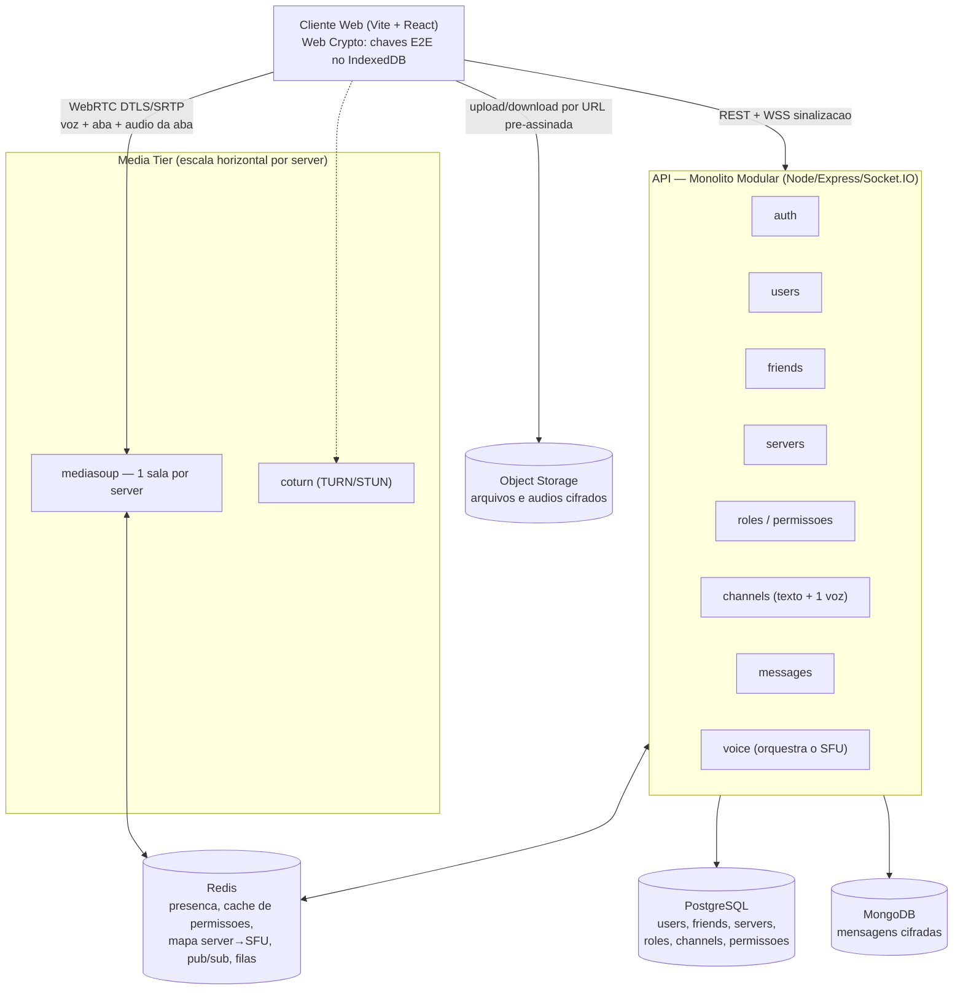
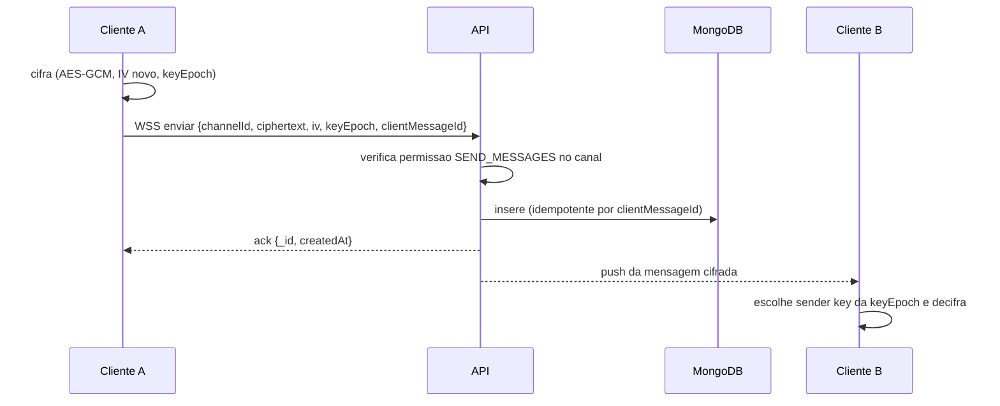
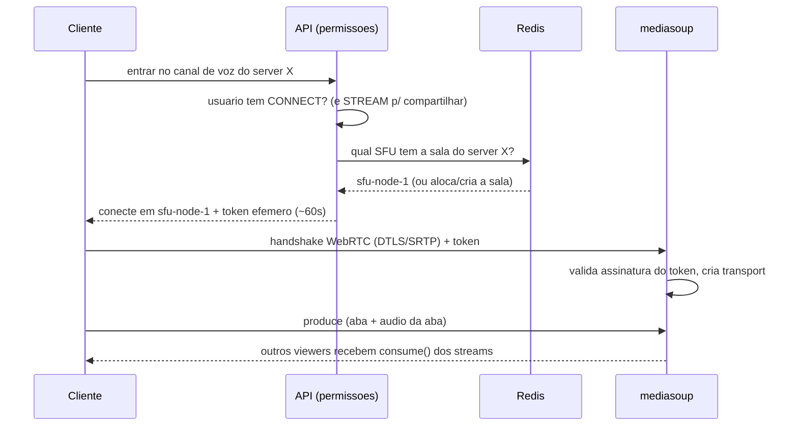

# Documento de Arquitetura — Plataforma de Chat e Voz estilo Discord

**Versão:** 1.0
**Tipo:** Aplicação web (SPA) com E2E, servers/canais, voz e compartilhamento de aba
**Stack:** TypeScript em toda a base — Express + Socket.IO (backend), Vite + React (frontend), mediasoup (SFU)

---

## 1. Resumo

Plataforma web de comunicação inspirada no Discord. Usuários têm **lista de amigos**, trocam **mensagens diretas criptografadas ponta a ponta (E2E)**, criam **servers** com **papéis e permissões**, e dentro de cada server existem **canais de texto** e **um único canal de voz**. É nesse canal de voz que acontece a **conversa por voz e o compartilhamento de tela** — restrito a **compartilhar uma aba do navegador e o áudio dessa aba** — distribuído a vários espectadores por um **SFU (mediasoup)**.

A decisão de manter **apenas um canal de voz por server** é uma escolha deliberada de **redução de custo de máquina**: cada server mapeia para no máximo uma sala de mídia, o que torna a alocação de recursos do SFU previsível e simples.

---

## 2. Decisões de arquitetura (e por quê)

| Decisão | Escolha | Motivo |
|---|---|---|
| Estilo geral | **Monolito modular (control plane) + serviço de mídia SFU separado (data plane)** | Texto/permissões e mídia em tempo real têm perfis de recurso opostos (I/O vs CPU/banda). Só a mídia justifica um processo à parte. |
| Banco relacional | **PostgreSQL** | Usuários, amigos, servers, membros, papéis, canais e permissões são altamente relacionais e exigem consistência forte. |
| Banco de mensagens | **MongoDB** | Mensagens são documentos opacos (ciphertext), de escrita sequencial e leitura paginada — encaixe natural. |
| Cache / coordenação | **Redis** | Presença, cache de permissões, mapa `server → SFU`, pub/sub entre instâncias, rate limiting e filas (BullMQ). |
| Mídia/arquivos | **Object Storage (S3 / Cloudflare R2 / MinIO)** | Arquivos e áudios cifrados ficam fora do banco, servidos por URL pré-assinada. |
| Tempo real (sinalização) | **Socket.IO** | Eventos de chat, presença e sinalização WebRTC. |
| Mídia em tempo real | **WebRTC + mediasoup (SFU)** | 1 publisher → N viewers encaminhando pacotes sem recodificar. Escala com custo razoável. |
| NAT traversal | **coturn (TURN/STUN)** | ~15–20% dos usuários precisam de relay; é infra obrigatória, não opcional. |
| Captura de tela | **`getDisplayMedia()` — apenas aba + áudio da aba** | É a API nativa do SO exposta com segurança pelo navegador; captura de aba entrega áudio confiável. |
| Autenticação | **JWT (access curto + refresh rotativo)** | Access token de ~15 min; refresh em cookie httpOnly, com hash no banco. |

---

## 3. Diagrama de componentes



Regra de ouro da separação: **a API decide, o SFU transporta.** O SFU nunca consulta o banco nem avalia permissão — ele apenas valida um token efêmero assinado pela API e encaminha mídia.

---

## 4. Estrutura da aplicação (monorepo)

```
/apps
  /api                      Express + Socket.IO (control plane)
    /src/modules
      /auth                 login, refresh rotativo, sessoes
      /users                perfil, chaves publicas E2E
      /friends              pedidos, aceite, bloqueio, lista
      /servers              servers, membros, invites
      /roles                calculo de permissoes, overwrites
      /channels             canais de texto + o unico canal de voz
      /messages             persistencia e paginacao (MongoDB)
      /voice                orquestra salas do SFU via Redis
      /media                URLs pre-assinadas, metadados
      /jobs                 mensagens efemeras, limpeza (BullMQ)
  /media                    servico SFU separado (mediasoup)
    /src
      /workers              1 worker mediasoup por core
      /rooms                1 router por server
      /transport            WebRTC transports, produce/consume
/packages
  /shared                   tipos dos eventos de socket, schemas Zod,
                            constantes de permissao
```

Limite de módulo obrigatório: `messages` **nunca** consulta as tabelas de `channels`/`servers` diretamente — usa uma interface (`channelsService.canView(userId, channelId)`).

> No repositório atual as pastas são `backend/` (o `api` acima) e `frontend/`; `/media` e `/packages/shared` ainda não existem.

### 4.1 Frontend (`frontend/`)

**Stack**: Vite + React + TypeScript, TanStack Query, React Router, Zod, Socket.IO client.

**Decisão central**: todo estado que vem da API é estado do TanStack Query — não existe store global espelhando dados do servidor. O que sobra de estado local é de UI (aba aberta, modal, rascunho de mensagem) e mora em `useState` dentro de um hook de página.

**Consequência dessa decisão**: `useEffect` é proibido no projeto. As razões clássicas para usá-lo já têm dono:

| Necessidade | Solução no projeto |
|---|---|
| Buscar dados | `useQuery` em `services/<modulo>/<modulo>.api.ts` |
| Gravar/alterar dados | `useMutation` + `queryClient.invalidateQueries(<modulo>Keys...)` |
| Valor derivado de props/estado | calcular no render (e `useMemo` só se medir custo) |
| Reagir a clique/submit/navegação | handler do evento |
| Resetar estado quando o id muda | `key={id}` no componente |
| Ler/medir DOM | ref callback |
| Assinar fonte externa (socket, `MediaStream`, `matchMedia`) | `useSyncExternalStore` sobre um wrapper em `services/` |
| Rodar algo antes da página montar | `loader` da rota (React Router) |

Se aparecer um caso que nenhuma linha acima cobre, o caso vira discussão de arquitetura — não vira `useEffect` solto num componente.

**Camadas e a regra de cada uma**

```
frontend/src/
  main.tsx                     React root + QueryClientProvider + RouterProvider
  routes.tsx                   árvore de rotas: layout -> pages
  lib/
    api.ts                     httpClient: baseURL, JSON, Authorization: Bearer,
                               access token em memória, retry único em 401 via POST /auth/refresh,
                               erro normalizado ({ status, message }) igual ao toErrorResponse do backend
    query-client.ts            QueryClient (staleTime, retry, refetchOnWindowFocus)
    socket.ts                  conexão Socket.IO autenticada (quando o módulo voice migrar)
    utils.ts                   funções puras sem React
  constants/
    routes.ts                  ROUTES do app  (única fonte de path para <Link> e navigate)
    endpoints.ts               ENDPOINTS da API (única fonte de path para o httpClient)
    socket-events.ts           SOCKET_EVENTS espelhando lib/constants.ts do backend
    limits.ts                  limites espelhados do backend (IMAGE_MAX_BYTES, tamanhos de senha/username)
  services/<modulo>/
    <modulo>.keys.ts           key factory: as() / list() / detail(id)
    <modulo>.api.ts            funções de request + hooks useQuery/useMutation
  hooks/                       estado de página e de UI; sem fetch, sem JSX
  pages/<modulo>/<Nome>Page.tsx   só composição: hooks + componentes
  layouts/
    RootLayout.tsx             app autenticado: guarda de sessão, shell (sidebar de servers,
                               lista de canais, header) e <Outlet/>
    AuthLayout.tsx             sign-in / sign-up: card centralizado, sem shell
  components/
    shared/                    Button, Input, Modal, Avatar, Spinner, ErrorState...
    <feature>/                 componentes daquela feature (ex.: channel/MessageList.tsx)
  schemas/<modulo>.schema.ts   Zod dos formulários (espelha o schema do backend)
  types/<modulo>.types.ts      todos os tipos/interfaces, inclusive props de componente
```

Fluxo de uma tela, de baixo para cima:

```
constants/endpoints.ts -> services/friends/friends.api.ts (useQuery com friendsKeys.list())
                       -> hooks/useFriendsPage.ts (filtro, aba selecionada, handlers)
                       -> pages/friends/FriendsPage.tsx (composição)
                       -> components/friends/FriendCard.tsx + components/shared/EmptyState.tsx
```

Módulos do frontend espelham os do backend: `auth`, `users`, `friends`, `servers`, `channels`, `messages`, `voice`, `media`.

**Rotas e layouts**

```
/                      RootLayout   (requer sessão; redireciona para /sign-in sem ela)
  /me                  DMs e amigos
  /servers/:serverId/channels/:channelId
  /settings
/sign-in               AuthLayout
/sign-up               AuthLayout
```

**Autenticação no cliente**: o access token fica em memória dentro de `lib/api.ts` (nunca em `localStorage`, que é legível por XSS). O refresh é o cookie httpOnly com `path=/auth`, então o navegador o envia sozinho em `POST /auth/refresh`; o front nunca o lê. Ao carregar o app, a rota raiz chama `/auth/refresh` uma vez para recuperar a sessão. Um 401 em qualquer request dispara um único refresh e repete o request original; se o refresh falhar, limpa o cache do Query e manda para `/sign-in`.

**Validação em duas camadas**: `schemas/` existe para feedback imediato no formulário. O backend revalida tudo em `<modulo>.schema.ts` — nenhuma regra de segurança depende do schema do cliente.

**E2E**: cifra e decifra ficam no cliente, em `services/messages/` (e futuramente `lib/crypto.ts`). Nenhuma chave privada sai do dispositivo, e nada cifrado passa por TanStack Query em texto claro — o que entra no cache já é o texto decifrado só em memória.

**Constantes duplicadas entre back e front** (`limits.ts`, `socket-events.ts`) são cópias manuais enquanto não existir `packages/shared`. Divergiu, quebra teste de integração; o backend continua sendo a autoridade.

---

## 5. Modelo de dados — PostgreSQL

Assume-se `pgcrypto` habilitado (`gen_random_uuid()`).

### 5.1 Usuários, chaves e sessões

```sql
CREATE TABLE users (
  id            UUID PRIMARY KEY DEFAULT gen_random_uuid(),
  username      VARCHAR(32)  NOT NULL UNIQUE,
  email         VARCHAR(255) NOT NULL UNIQUE,
  password_hash TEXT         NOT NULL,          -- argon2id
  display_name  VARCHAR(64),
  avatar_url    TEXT,
  created_at    TIMESTAMPTZ  NOT NULL DEFAULT now(),
  updated_at    TIMESTAMPTZ  NOT NULL DEFAULT now()
);

-- Chave publica de cada usuario, usada para E2E (DMs e distribuicao de sender keys)
CREATE TABLE user_keys (
  id            UUID PRIMARY KEY DEFAULT gen_random_uuid(),
  user_id       UUID NOT NULL REFERENCES users(id) ON DELETE CASCADE,
  public_key    TEXT NOT NULL,                  -- SPKI base64 (ECDH P-256)
  algorithm     VARCHAR(32) NOT NULL DEFAULT 'ECDH-P256',
  is_active     BOOLEAN NOT NULL DEFAULT true,
  created_at    TIMESTAMPTZ NOT NULL DEFAULT now()
);
CREATE INDEX idx_user_keys_user ON user_keys(user_id) WHERE is_active;

-- Refresh tokens rotativos: guarda-se apenas o hash
CREATE TABLE sessions (
  id                 UUID PRIMARY KEY DEFAULT gen_random_uuid(),
  user_id            UUID NOT NULL REFERENCES users(id) ON DELETE CASCADE,
  refresh_token_hash TEXT NOT NULL,             -- sha256 do refresh token
  user_agent         TEXT,
  ip                 INET,
  expires_at         TIMESTAMPTZ NOT NULL,
  created_at         TIMESTAMPTZ NOT NULL DEFAULT now(),
  revoked_at         TIMESTAMPTZ
);
CREATE INDEX idx_sessions_user ON sessions(user_id) WHERE revoked_at IS NULL;
```

### 5.2 Lista de amigos

Modelada com uma linha por relacionamento, em **ordem canônica** (`user_low_id < user_high_id`) para impedir duplicatas, mais o campo `requested_by` para saber a direção do pedido.

```sql
CREATE TYPE friendship_status AS ENUM ('pending', 'accepted', 'blocked');

CREATE TABLE friendships (
  id            UUID PRIMARY KEY DEFAULT gen_random_uuid(),
  user_low_id   UUID NOT NULL REFERENCES users(id) ON DELETE CASCADE,
  user_high_id  UUID NOT NULL REFERENCES users(id) ON DELETE CASCADE,
  status        friendship_status NOT NULL DEFAULT 'pending',
  requested_by  UUID NOT NULL REFERENCES users(id),  -- quem enviou o pedido
  blocked_by    UUID REFERENCES users(id),           -- quem bloqueou (se status=blocked)
  created_at    TIMESTAMPTZ NOT NULL DEFAULT now(),
  responded_at  TIMESTAMPTZ,
  CONSTRAINT canonical_order CHECK (user_low_id < user_high_id),
  CONSTRAINT unique_pair UNIQUE (user_low_id, user_high_id)
);
CREATE INDEX idx_friend_low  ON friendships(user_low_id, status);
CREATE INDEX idx_friend_high ON friendships(user_high_id, status);
```

Ao inserir, a aplicação ordena os dois IDs antes de gravar. "São amigos?" = existe linha com o par ordenado e `status = 'accepted'`.

### 5.3 Servers, membros, papéis e convites

```sql
CREATE TYPE server_visibility AS ENUM ('public', 'private');

CREATE TABLE servers (
  id          UUID PRIMARY KEY DEFAULT gen_random_uuid(),
  owner_id    UUID NOT NULL REFERENCES users(id),
  name        VARCHAR(100) NOT NULL,
  icon_url    TEXT,
  visibility  server_visibility NOT NULL DEFAULT 'public',
  created_at  TIMESTAMPTZ NOT NULL DEFAULT now()
);

CREATE TABLE server_members (
  id          UUID PRIMARY KEY DEFAULT gen_random_uuid(),
  server_id   UUID NOT NULL REFERENCES servers(id) ON DELETE CASCADE,
  user_id     UUID NOT NULL REFERENCES users(id)   ON DELETE CASCADE,
  nickname    VARCHAR(64),
  joined_at   TIMESTAMPTZ NOT NULL DEFAULT now(),
  CONSTRAINT unique_member UNIQUE (server_id, user_id)
);
CREATE INDEX idx_members_server ON server_members(server_id);
CREATE INDEX idx_members_user   ON server_members(user_id);

-- Permissoes como bitfield (BIGINT). is_default marca o papel @everyone.
CREATE TABLE roles (
  id           UUID PRIMARY KEY DEFAULT gen_random_uuid(),
  server_id    UUID NOT NULL REFERENCES servers(id) ON DELETE CASCADE,
  name         VARCHAR(64) NOT NULL,
  color        INTEGER,
  permissions  BIGINT NOT NULL DEFAULT 0,
  position     INTEGER NOT NULL DEFAULT 0,     -- hierarquia
  is_default   BOOLEAN NOT NULL DEFAULT false, -- @everyone
  created_at   TIMESTAMPTZ NOT NULL DEFAULT now()
);
CREATE INDEX idx_roles_server ON roles(server_id);
-- Garante exatamente um @everyone por server
CREATE UNIQUE INDEX one_default_role ON roles(server_id) WHERE is_default;

CREATE TABLE member_roles (
  member_id  UUID NOT NULL REFERENCES server_members(id) ON DELETE CASCADE,
  role_id    UUID NOT NULL REFERENCES roles(id)          ON DELETE CASCADE,
  PRIMARY KEY (member_id, role_id)
);

CREATE TABLE invites (
  code        VARCHAR(16) PRIMARY KEY,          -- codigo curto aleatorio
  server_id   UUID NOT NULL REFERENCES servers(id) ON DELETE CASCADE,
  created_by  UUID NOT NULL REFERENCES users(id),
  max_uses    INTEGER,                          -- NULL = ilimitado
  uses        INTEGER NOT NULL DEFAULT 0,
  expires_at  TIMESTAMPTZ,                      -- NULL = nao expira
  created_at  TIMESTAMPTZ NOT NULL DEFAULT now()
);
```

### 5.4 Canais (texto + o único de voz)

O tipo do canal é um enum. A regra de **um único canal de voz por server** é imposta no banco por um **índice único parcial**.

```sql
CREATE TYPE channel_type AS ENUM ('text', 'voice');

CREATE TABLE channels (
  id          UUID PRIMARY KEY DEFAULT gen_random_uuid(),
  server_id   UUID NOT NULL REFERENCES servers(id) ON DELETE CASCADE,
  type        channel_type NOT NULL,
  name        VARCHAR(100) NOT NULL,
  topic       TEXT,
  position    INTEGER NOT NULL DEFAULT 0,
  created_at  TIMESTAMPTZ NOT NULL DEFAULT now()
);
CREATE INDEX idx_channels_server ON channels(server_id);

-- REDUCAO DE CUSTO: no maximo 1 canal de voz por server
CREATE UNIQUE INDEX one_voice_per_server
  ON channels(server_id) WHERE type = 'voice';

-- Overwrites de permissao por canal (estilo Discord: allow/deny por papel ou membro)
CREATE TYPE overwrite_target AS ENUM ('role', 'member');

CREATE TABLE channel_overwrites (
  id           UUID PRIMARY KEY DEFAULT gen_random_uuid(),
  channel_id   UUID NOT NULL REFERENCES channels(id) ON DELETE CASCADE,
  target_type  overwrite_target NOT NULL,
  target_id    UUID NOT NULL,                   -- role_id ou member_id/user_id
  allow        BIGINT NOT NULL DEFAULT 0,
  deny         BIGINT NOT NULL DEFAULT 0,
  CONSTRAINT unique_overwrite UNIQUE (channel_id, target_type, target_id)
);
```

### 5.5 Estado de leitura e metadados de mídia

```sql
CREATE TABLE channel_read_state (
  user_id            UUID NOT NULL REFERENCES users(id)    ON DELETE CASCADE,
  channel_id         UUID NOT NULL REFERENCES channels(id) ON DELETE CASCADE,
  last_read_msg_id   VARCHAR(24),                -- ObjectId do MongoDB como string
  mention_count      INTEGER NOT NULL DEFAULT 0,
  updated_at         TIMESTAMPTZ NOT NULL DEFAULT now(),
  PRIMARY KEY (user_id, channel_id)
);

CREATE TABLE media_files (
  id           UUID PRIMARY KEY DEFAULT gen_random_uuid(),
  uploader_id  UUID NOT NULL REFERENCES users(id),
  channel_id   UUID REFERENCES channels(id) ON DELETE SET NULL,
  storage_key  TEXT NOT NULL,                   -- chave no object storage
  mime_type    VARCHAR(100) NOT NULL,
  size_bytes   BIGINT NOT NULL,
  is_encrypted BOOLEAN NOT NULL DEFAULT true,
  iv           TEXT,                             -- IV usado na cifra do arquivo
  created_at   TIMESTAMPTZ NOT NULL DEFAULT now(),
  expires_at   TIMESTAMPTZ                       -- para midia efemera
);
CREATE INDEX idx_media_expiry ON media_files(expires_at) WHERE expires_at IS NOT NULL;
```

---

## 6. Modelo de dados — MongoDB (mensagens cifradas)

O servidor **não consegue ler** o conteúdo — armazena apenas ciphertext e metadados de roteamento. Uma única coleção `messages` serve DMs e canais de texto (o campo `channelId` identifica o destino; para DMs usa-se um id de conversa direta).

```js
// Colecao: messages
{
  _id:            ObjectId,      // ordenavel por tempo -> paginacao por cursor
  channelId:      "uuid",        // canal de texto OU id da conversa direta
  scope:          "channel",     // "channel" (server) | "dm"
  senderId:       "uuid",
  clientMessageId:"uuid",        // idempotencia (reconexao/retry)

  contentType:    "text",        // "text" | "audio" | "file"
  ciphertext:     "base64",      // AES-GCM
  iv:             "base64",      // IV aleatorio POR mensagem
  keyEpoch:       12,            // qual sender key (grupos) decifra; null em DM

  attachments: [                 // referencia a media_files (Postgres)
    { mediaId: "uuid", mime: "audio/opus", iv: "base64" }
  ],

  replyToId:      "ObjectId|null",
  editedAt:       "Date|null",
  expiresAt:      "Date|null",   // mensagem efemera (indice TTL)
  createdAt:      "Date"
}
```

### Índices

```js
db.messages.createIndex({ channelId: 1, _id: -1 })                 // paginacao
db.messages.createIndex({ senderId: 1, clientMessageId: 1 },        // idempotencia
                        { unique: true })
db.messages.createIndex({ expiresAt: 1 }, { expireAfterSeconds: 0 })// TTL efemeras
db.messages.createIndex({ channelId: 1, keyEpoch: 1 })              // troca de chave
```

Consequências assumidas:
- **Não há transação entre Postgres e Mongo.** O canal é criado no Postgres primeiro; só então mensagens que o referenciam são aceitas. UUIDs são a ponte entre os dois bancos.
- **Busca por texto é feita no cliente** (índice local no IndexedDB), pois o servidor só vê ciphertext.
- "Lido por" **não** é array dentro da mensagem — usa-se o ponteiro `last_read_msg_id` em `channel_read_state`.

---

## 7. Criptografia ponta a ponta (E2E)

Toda a criptografia roda no **cliente** com a **Web Crypto API**. Chaves privadas são `CryptoKey` **não extraíveis**, guardadas no **IndexedDB**. O servidor só transporta e armazena ciphertext.

Primitivas: **ECDH P-256** (acordo de chave) + **HKDF** (derivação) + **AES-GCM 256** (cifra). IV **aleatório por mensagem**.

### 7.1 Mensagens diretas (DM entre amigos)

1. Cada usuário publica sua chave pública (`user_keys`).
2. Emissor faz ECDH entre sua chave privada e a pública do amigo → segredo compartilhado → HKDF → chave AES.
3. Cifra com AES-GCM (IV novo por mensagem) e envia `{ ciphertext, iv }`.
4. Receptor deriva a mesma chave e decifra.

### 7.2 Canais de texto de server (grupo) — *sender keys*

E2E em grupo não usa ECDH par a par (não escala). Usa-se o modelo de **sender keys**:

- Cada canal tem uma **chave simétrica de canal** por **época** (`keyEpoch`).
- Essa chave é distribuída a cada membro **cifrada com a chave pública de cada um**.
- Mensagens são cifradas com a chave da época atual; a mensagem carrega `keyEpoch` para o membro escolher a chave certa.
- Ao **entrar ou sair alguém**, gera-se **nova época** (rotação) — garante *forward secrecy* prático.

Tabelas de apoio no Postgres (armazenam apenas material **já cifrado**):

```sql
CREATE TABLE channel_key_epochs (
  id          UUID PRIMARY KEY DEFAULT gen_random_uuid(),
  channel_id  UUID NOT NULL REFERENCES channels(id) ON DELETE CASCADE,
  epoch       INTEGER NOT NULL,
  created_by  UUID NOT NULL REFERENCES users(id),
  created_at  TIMESTAMPTZ NOT NULL DEFAULT now(),
  CONSTRAINT unique_epoch UNIQUE (channel_id, epoch)
);

-- A sender key, cifrada individualmente para cada membro com a chave publica dele
CREATE TABLE channel_key_shares (
  epoch_id       UUID NOT NULL REFERENCES channel_key_epochs(id) ON DELETE CASCADE,
  recipient_id   UUID NOT NULL REFERENCES users(id) ON DELETE CASCADE,
  encrypted_key  TEXT NOT NULL,   -- sender key cifrada com a chave publica do membro
  iv             TEXT NOT NULL,
  PRIMARY KEY (epoch_id, recipient_id)
);
```

> **Nota de escopo:** DM com ECDH é simples e recomendada para o MVP. Sender keys em grupo é a parte avançada — vale incluir pelo valor acadêmico, mas pode ficar numa fase posterior. **Multi-dispositivo com E2E fica fora do escopo inicial.**

### 7.3 Fluxo de envio de mensagem



---

## 8. Permissões (estilo Discord, bitfield)

Permissões são bits em um `BIGINT`. Constantes compartilhadas em `/packages/shared`:

```ts
export const Permission = {
  VIEW_CHANNEL:    1n << 0n,
  SEND_MESSAGES:   1n << 1n,
  MANAGE_MESSAGES: 1n << 2n,
  CONNECT:         1n << 3n,  // entrar no canal de voz
  SPEAK:           1n << 4n,  // transmitir audio
  STREAM:          1n << 5n,  // compartilhar tela/aba
  MANAGE_CHANNELS: 1n << 6n,
  MANAGE_ROLES:    1n << 7n,
  KICK_MEMBERS:    1n << 8n,
  BAN_MEMBERS:     1n << 9n,
  CREATE_INVITE:   1n << 10n,
  MANAGE_SERVER:   1n << 11n,
  ADMINISTRATOR:   1n << 12n, // ignora todas as checagens
} as const;
```

### Algoritmo de resolução (calculado em runtime, cacheado no Redis)

```ts
function resolvePermissions(member, roles, channelOverwrites, server): bigint {
  if (server.ownerId === member.userId) return ALL_PERMISSIONS;

  // 1) base: papel @everyone
  let perms = everyoneRole.permissions;

  // 2) OR de todos os papeis do membro
  for (const r of member.roles) perms |= r.permissions;

  // ADMINISTRATOR ignora o resto
  if (perms & Permission.ADMINISTRATOR) return ALL_PERMISSIONS;

  // 3) overwrites do canal: @everyone -> papeis -> membro
  const apply = (ov) => { perms &= ~ov.deny; perms |= ov.allow; };
  applyIf(channelOverwrites, 'role',   everyoneRole.id, apply);
  for (const r of member.roles) applyIf(channelOverwrites, 'role', r.id, apply);
  applyIf(channelOverwrites, 'member', member.id, apply);

  return perms;
}
```

O resultado é cacheado por `(userId, channelId)` no Redis e **invalidado** quando papéis, membros ou overwrites mudam. É o principal cache de leitura quente do sistema.

---

## 9. Voz e compartilhamento de aba (o canal de voz único)

Cada server tem no máximo **um canal de voz**, que mapeia **1:1 para uma sala no SFU**. É onde acontecem a voz e o compartilhamento de tela.

### 9.1 Por que "um canal de voz por server" reduz custo

- **Mapeamento trivial:** `server → sala SFU`, guardado no Redis. Sem necessidade de rotear entre múltiplas salas por server.
- **Capacidade previsível:** o dimensionamento do SFU é feito por número de servers com voz ativa, não por combinações de canais.
- **Menos salas ociosas:** salas são criadas sob demanda (primeiro a entrar cria; última a sair destrói).

### 9.2 Restrição de captura: apenas aba + áudio da aba

A aplicação usa `getDisplayMedia()` **forçando a fonte "aba"**, o que garante o **áudio daquela aba** de forma confiável (o caso em que o navegador entrega áudio junto com o vídeo).

```ts
const stream = await navigator.mediaDevices.getDisplayMedia({
  video: { frameRate: 30 },
  audio: {                       // audio de MIDIA: desligar filtros de voz
    echoCancellation: false,
    noiseSuppression: false,
    autoGainControl: false,
  },
  // dicas de UX para priorizar a opcao de aba
  // @ts-expect-error hints ainda nao padronizadas em todos os browsers
  preferCurrentTab: false,
  selfBrowserSurface: 'include',
  surfaceSwitching: 'include',
});

const videoTrack = stream.getVideoTracks()[0];
const audioTrack = stream.getAudioTracks()[0];   // pode vir undefined

// qualidade: sinaliza que e conteudo (nitidez > fluidez p/ tela)
videoTrack.contentHint = 'detail';

if (!audioTrack) {
  // UX: "Para transmitir com som, compartilhe uma ABA do navegador."
}
```

**Sobre "qualidade usando a API nativa do OS":** `getDisplayMedia()` é a própria interface nativa de captura do SO exposta pelo navegador (ScreenCaptureKit / Windows.Graphics.Capture / PipeWire por baixo). Não é uma emulação — a qualidade vem do SO. Por ser aplicação web, não há acesso direto sem essa API, e para o requisito (aba + áudio da aba) ela é exatamente a ferramenta certa.

### 9.3 Producers separados + simulcast

Áudio e vídeo entram como **dois producers independentes** no mediasoup (permite mutar o áudio sem cortar o vídeo). O vídeo usa **simulcast** (3 camadas) para que viewers com rede ruim recebam automaticamente uma resolução menor.

```ts
await sendTransport.produce({ track: videoTrack, encodings: [
  { rid: 'q', scaleResolutionDownBy: 4, maxBitrate: 250_000  }, // baixa
  { rid: 'h', scaleResolutionDownBy: 2, maxBitrate: 800_000  }, // media
  { rid: 'f', scaleResolutionDownBy: 1, maxBitrate: 2_500_000 },// full 1080p
], codecOptions: { videoGoogleStartBitrate: 1000 } });

if (audioTrack) await sendTransport.produce({ track: audioTrack });
```

### 9.4 Sinalização (a API decide, o SFU transporta)



O **token efêmero** é assinado pela API; o SFU só valida a assinatura, mantendo-se sem estado de permissão.

> **Importante:** a mídia do SFU **não é E2E por padrão** — o SFU encaminha SRTP que ele poderia inspecionar. As **mensagens de texto/DM continuam E2E**; a voz/tela usa a criptografia de transporte do WebRTC (DTLS/SRTP). E2E de mídia (via *insertable streams*) fica fora do escopo inicial.

---

## 10. Cache, filas e presença (Redis)

| Uso | TTL | Invalidação |
|---|---|---|
| Presença online | 30–60 s (heartbeat) | Expira se o cliente cair |
| "Digitando…" | 5 s | Expiração |
| Permissões resolvidas `(user, channel)` | 5–10 min | Apagar chave ao mudar papel/overwrite/membro |
| Mapa `server → SFU` | vida da sala | Apagar quando a sala é destruída |
| JWT revogado (blocklist) | tempo restante do token | Expiração |
| Rate limiting | janela de 1 min | Expiração |

**Filas (BullMQ sobre o mesmo Redis):** mensagens efêmeras/agendadas, limpeza de mídia expirada no storage, notificações. No início o worker roda no mesmo processo da API; separa-se só se a carga pedir.

---

## 11. Infraestrutura por estágio

### Estágio inicial (MVP)
- **Frontend:** Vercel.
- **API:** Render/Railway ou uma VPS pequena.
- **SFU + coturn:** **VPS com IP público** e banda boa (Hetzner/DigitalOcean). Media em tempo real não roda em PaaS típica nem em camada gratuita realista.
- **Postgres / Mongo / Redis:** Neon + MongoDB Atlas (M0) + Upstash.
- **Storage:** Cloudflare R2 (sem custo de egress).

### Estágio de crescimento
- Múltiplas instâncias da API com `@socket.io/redis-adapter` + sticky sessions.
- Worker BullMQ em processo próprio.
- SFU vertical (mais cores = mais workers mediasoup).

### Estágio de escala
- SFU horizontal: distribuir **servers** entre nós (o mapa `server → SFU` no Redis já suporta isso).
- Réplica de leitura no Postgres; replica set no MongoDB.
- coturn dedicado/dimensionado por banda.

---

## 12. Estimativa de capacidade (estimativas, sem benchmark real)

Base herdada: alvo de **~1.000 usuários**, com dezenas de espectadores por transmissão.

- **Conexões WebSocket:** 300–500 simultâneas cabem num único processo Node com folga.
- **SFU:** 1 core moderno encaminha ~500 Mbps. Um screen share de aba a ~2,5 Mbps para **50 viewers** ≈ 125 Mbps → cabe num core. O que estoura primeiro é o **fan-out** (nº de consumers), não o publisher.
- **Mensagens:** ~50 mil/dia a ~1 KB ≈ 50 MB/dia; irrelevante para o Mongo nesse volume.
- **Mídia/arquivos:** principal fator de crescimento e custo (áudio Opus ~10–20 KB/s; arquivos pesam mais).

**Gargalos prováveis, em ordem:** banda/CPU do SFU no fan-out → armazenamento de mídia → limites das camadas gratuitas → fan-out de canais de texto muito grandes.

---

## 13. Segurança e LGPD

- **Auth:** access token ~15 min; refresh rotativo em cookie httpOnly (hash no banco). JWT validado no handshake do Socket.IO.
- **Senhas:** argon2id.
- **Autorização:** RBAC por servidor (bitfield + overwrites), sempre checada na API — nunca no SFU.
- **Rate limiting**, validação com **Zod**, **helmet**, **CORS** restrito.
- **Isolamento de dados:** todo acesso a canal/mensagem passa por checagem de pertencimento ao server.
- **E2E:** DMs e canais de texto com ciphertext opaco ao servidor.
- **Backups** de Postgres e Mongo; **exclusão de conta** que apague mensagens e mídia (direito de exclusão LGPD).

---

## 14. Riscos e mitigações

| Risco | Mitigação |
|---|---|
| Áudio não vem ao compartilhar (fonte não é aba) | Forçar/orientar aba; detectar `getAudioTracks()` vazio e avisar |
| NAT/firewall bloqueando WebRTC (~1/5 dos usuários) | coturn obrigatório desde o MVP |
| Custo de banda do SFU | Simulcast + limite de bitrate/resolução |
| Perda da chave privada = histórico E2E perdido | Backup de chave protegido por senha (PBKDF2), documentado como limitação |
| Mensagem duplicada em reconexão | `clientMessageId` idempotente + sincronização por cursor |
| Inconsistência Postgres × Mongo | Postgres como fonte da verdade; canal criado antes da mensagem |
| Permissão vazando para o SFU | SFU só valida token efêmero; nunca decide permissão |
| E2E de grupo mal implementado | Web Crypto only; IV por mensagem; rotação de época ao mudar membros |

---

## 15. Complexidade operacional e custo

**Complexidade: alta.** São Postgres + Mongo + Redis + Object Storage + Socket.IO + WebRTC/SFU + coturn. WebRTC é difícil de depurar — compensar com observabilidade (`mediasoup getStats`, perda de pacotes e RTT por conexão, logs estruturados, error tracking).

**Custo (ordem de grandeza):**
- **Desenvolvimento/MVP:** ~zero local (docker-compose com todos os serviços).
- **Produção inicial:** baixo, mas com **VPS obrigatória para SFU/coturn** (a mídia é o piso de custo).
- **Crescimento:** dezenas de dólares/mês, dominado por **banda de mídia**.

---

## 16. Decisão final

Para o cenário, a arquitetura é um **monolito modular (control plane) em TypeScript/Express/Socket.IO**, com **PostgreSQL** (usuários, amigos, servers, papéis, canais, permissões), **MongoDB** (mensagens cifradas), **Redis** (cache/presença/filas/coordenação), **Object Storage** para mídia, e um **serviço de mídia SFU separado (mediasoup) + coturn** para voz e compartilhamento de aba.

Mantém-se **um canal de voz por server** como decisão de custo, com mapeamento 1:1 para a sala do SFU. A captura usa `getDisplayMedia()` restrita a **aba + áudio da aba**, entregando qualidade nativa do SO sem sair do modelo web.

**Não** se adota microsserviços além da separação da mídia, porque só ela tem justificativa concreta (perfil de recurso e escala próprios). Os primeiros sinais de que a arquitetura precisa evoluir seriam: **CPU do SFU acima de ~70% no pico**, **perda de pacotes subindo**, ou **necessidade de mais de uma instância da API** para disponibilidade.
